# Municipal Services — Citizen Engagement (ASP.NET Core MVC, .NET 8)

This is my Part 1 implementation as a modern web app. I focused on a simple, reliable experience where residents can report issues with attachments, get immediate progress feedback, and see transparent queue handling (FIFO) with JSON persistence.

Screenshots are referenced below — add your images to `docs/` with the listed filenames.

## Contents
- Overview
- Requirements matrix (how the brief is met)
- Tech stack & architecture
- Projects and file layout
- How to run (VS2022 and CLI)
- Usage guide (step-by-step)
- Data handling & persistence
- Engagement & accessibility
- Privacy & security notes
- Troubleshooting

## Overview
Residents can submit issues with location, category, description, and multiple attachments. The app stores tickets in a queue (FIFO) and displays the submitter’s queue position on the success screen. An optional name/surname and contact details can be provided along with update preferences (email/SMS). The UI is responsive and polished.

### Key Screens
Home (Main menu)

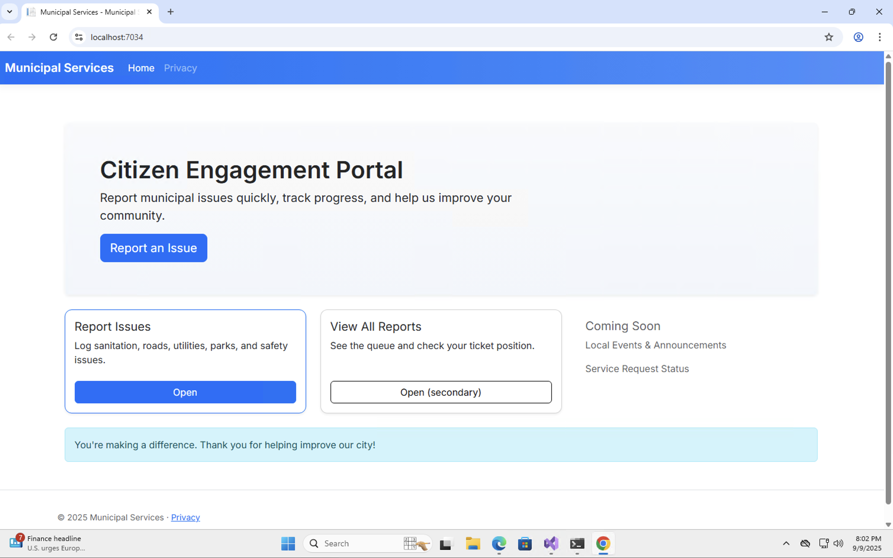

Report Issue (Create)

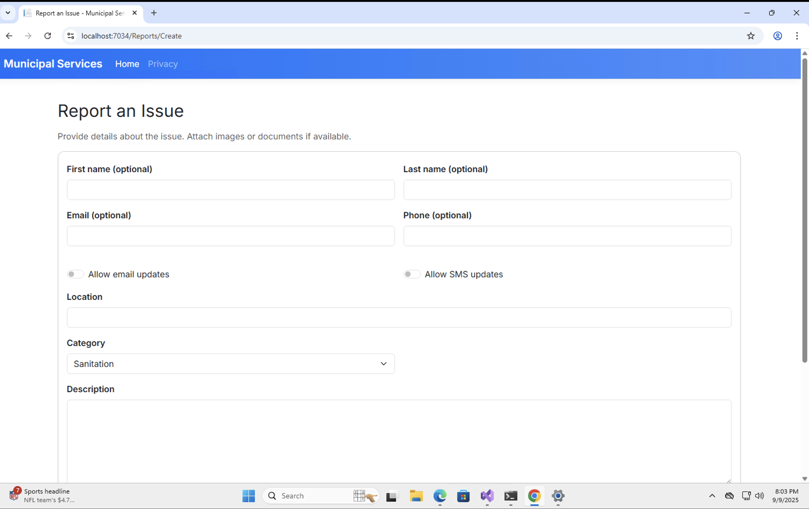

Report Success (Details with queue position)

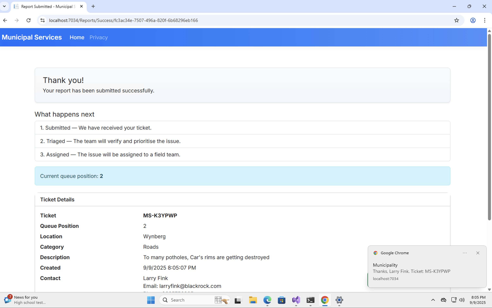

All Reports (Public list)

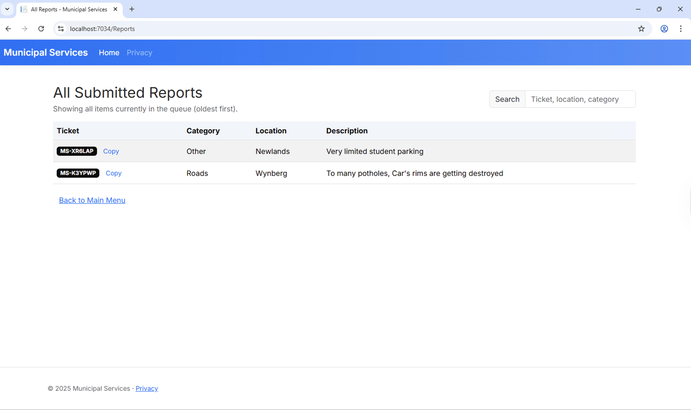

## Requirements Matrix
- Main menu with three tasks; only “Report Issues” enabled: Implemented in `Views/Home/Index.cshtml`.
- Report Issues form fields: location (TextBox), category (Dropdown), description (RichTextBox equivalent), attachments (OpenFileDialog/upload): Implemented in `Views/Reports/Create.cshtml`.
- Submit button and navigation back: Implemented in `Create.cshtml` with a back link and a submit button.
- Engagement feature: animated progress bar, rotating encouragement toasts during submission, one‑time success toast + optional browser notification: `Create.cshtml` and `Success.cshtml`.
- Data structure: queue for issues with JSON persistence: `MunicipalityMvc.Core/Services/IssueService.cs`.
- Responsiveness and consistent design: Bootstrap + custom theme in `wwwroot/css/site.css` and `_Layout.cshtml`.
- Privacy in public list: only ticket, category, description; no contact/location: `Views/Reports/Index.cshtml`.

## Tech Stack & Architecture
- .NET 8, ASP.NET Core MVC (no external NuGet packages required beyond shared framework).
- Project `MunicipalityMvc.Core`: domain models (`IssueReport`), service contract (`IIssueService`), and implementation (`IssueService`).
- Project `MunicipalityMvc.Web`: MVC app; controllers, views, `Program.cs` DI configuration.
- Dependency Injection: `Program.cs` registers `IIssueService` as a singleton, persisting data under `AppData/data`.

## Projects and Layout
- `MunicipalityMvc.Core`
  - `Models/IssueReport.cs`: ticket fields; includes optional `FirstName`, `LastName`, `Email`, `Phone`, and `WantsEmailUpdates`, `WantsSmsUpdates`.
  - `Services/IIssueService.cs`, `Services/IssueService.cs`: queue-based storage, JSON persistence, attachment handling, queue position.
- `MunicipalityMvc.Web`
  - `Controllers/ReportsController.cs`: Create, Success, and Index actions.
  - `Views/Reports/{Create,Success,Index}.cshtml`: UI pages.
  - `Views/Shared/_Layout.cshtml`: global layout, toast container helpers.
  - `wwwroot/css/site.css`: theme/branding.
  - `AppData/data/`: issues.json and per-ticket attachment folders (created at runtime).

## How To Run
### Visual Studio 2022
1. Prerequisites
   - Visual Studio 2022 17.8 or later
   - Workload: “ASP.NET and web development” (includes .NET 8 SDK)
2. Unzip & open
   - Download the ZIP of this repository
   - Extract to a short path (e.g., `C:\Projects\MunicipalityMVC`) to avoid long path issues
   - Double‑click `MunicipalityMVC.sln` to open the solution in Visual Studio
3. Restore & select startup
   - VS will restore automatically (no third‑party packages are used)
   - In Solution Explorer, right‑click `MunicipalityMvc.Web` → Set as Startup Project
4. Run / debug
   - Press F5 (Debug) or Ctrl+F5 (Run without debugging)
   - Your browser will open to `https://localhost:<port>` (Kestrel or IIS Express)
5. Try the flow
   - Home → Report an Issue → Fill the form → Submit → Success (note ticket code and queue position)
   - Home → View All Reports → See public list (Ticket, Category, Location, Description)

### .NET CLI
```
dotnet build MunicipalityMVC.sln -c Release
dotnet run --project MunicipalityMvc.Web
```
The app will open at `http://localhost:<port>`.

### Running from a ZIP (quick checklist)
1) Extract the ZIP to a short path (avoid long OneDrive paths)
2) Open `MunicipalityMVC.sln` in VS2022
3) Set startup project to `MunicipalityMvc.Web`
4) Build, then F5

## Usage Guide
1. Home → click “Report an Issue”.
2. Optionally enter name/surname and contact info; choose email/SMS updates.
3. Enter location, select category, and provide a clear description.
4. Add one or more attachments. Submit.
5. Submission shows an animated progress bar and rotating messages, then redirects to Success.
6. Success shows your Ticket code, queue position, details, attachments, and a one‑time toast/notification.
7. Home → “View All Reports” lists tickets (ticket/category/description only).

## Feature Walkthrough (with screenshots)
Below are the key features, each paired with a screenshot placeholder you can replace.

1) Main Menu (Home)
- What you see: Friendly hero, primary CTA to “Report an Issue”, cards for key actions.
- Why it matters: Meets brief by showing three tasks and enabling only Report Issues initially.


2) Report Issue (Create)
- Fields: Name + Surname (optional), Email + Phone (optional), Allow Email Updates, Allow SMS Updates, Location, Category, Description, Attachments (multi‑upload).
- UX: Clean card layout; validation; submission button shows spinner; animated progress bar runs with encouraging messages.


3) Proactive Feedback During Submit
- What happens: As soon as Submit is clicked, we show an animated progress bar and cycle helpful toasts (e.g., “Packing your report…”, “Saving to the queue…”). This both informs and motivates.
- Implementation: Lightweight front‑end timer, followed by a real submit; no server delay required.

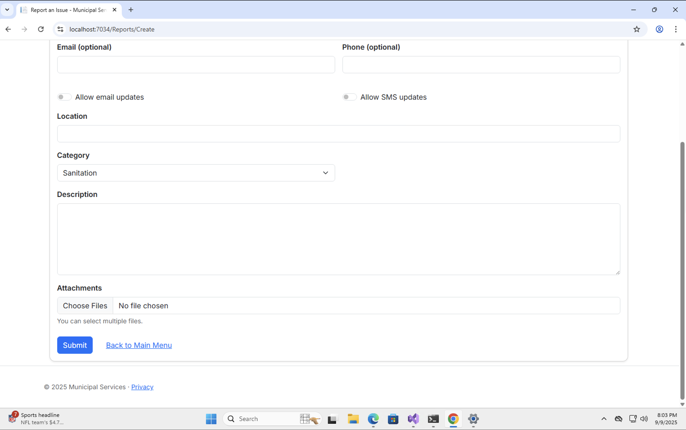

4) Success Page
- Shows: Ticket code (short, friendly), queue position, full details, attachment filenames.
- Feedback: One‑time toast (and browser notification if permitted) personalized with the submitter’s name.
- Privacy: Only the owner sees contact details here; the public list hides contact info.


5) Public Reports List
- Shows: Ticket, Category, Location, and Description only.
- Extras: Copy ticket to clipboard; client‑side search box.


## Data Handling & Persistence
- Queue storage: `IssueService` keeps an in-memory `Queue<IssueReport>` and persists the full queue to `issues.json`.
- Attachments: copied into `AppData/data/<ticket-id>/` using original filenames; file list saved with the ticket.
- Contact info & preferences: Optional `FirstName`, `LastName`, `Email`, `Phone`, plus `WantsEmailUpdates` and `WantsSmsUpdates` are stored per ticket for future parts (e.g., sending updates).
- No database server required; runs offline.

### Data Flow (end-to-end)
1) `ReportsController.Create (POST)` receives form fields and attachments.
2) Files are staged with original names and passed to `IssueService.AddAsync`.
3) `IssueService` copies files into the ticket folder, enqueues the report, and re‑writes `issues.json`.
4) The browser is redirected to Success, which reads the ticket and computes queue position.
5) The public list reads the whole queue as a summary.

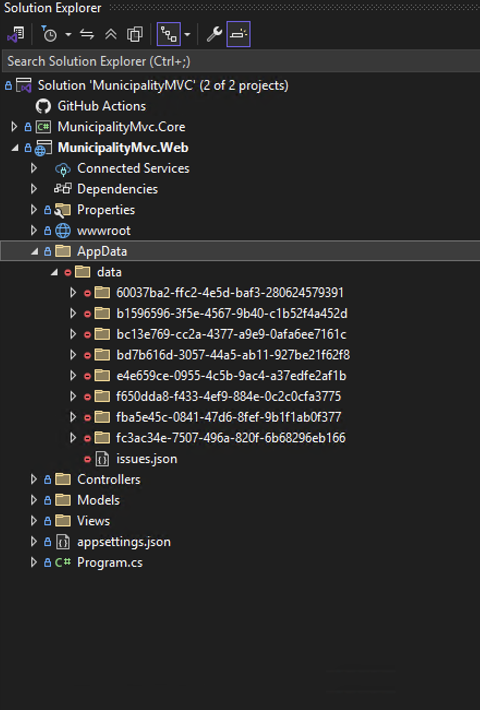

## Engagement & Accessibility
- Submission feedback: progress bar + encouraging toasts while preparing the ticket.
- Email/SMS update switches: Users can opt into updates (stored with the ticket). These preferences are persisted for later phases.
- Success feedback: one-time toast and optional browser notification (permission‑based) personalized with the submitter’s name.
- Keyboard navigation and labels for inputs; responsive design.

## Privacy & Security Notes
- Public list hides personal/contact info; shows only Ticket, Category, and Description.
- Input is trimmed server-side; unexpected notification permissions are not required.
- Files are stored locally; no external uploads.

## Troubleshooting
- .NET 8 SDK / VS version issues
  - Install .NET 8 SDK and VS2022 17.8+; close and reopen the solution
- HTTPS developer certificate prompt
  - When VS asks to trust the developer certificate, click Yes; or browse with `http://localhost:<port>` if you prefer
- Access denied writing to `MunicipalityMvc.Web/AppData/data`
  - Move the solution to a writeable folder (e.g., `C:\Projects\MunicipalityMVC`) and avoid controlled/roaming paths
- Port conflicts or stale debug sessions
  - Stop all instances, close browsers, then run again; confirm the port in the address bar
- Browser notifications not showing
  - They are optional; the app still shows in‑app toasts if you deny permission
- Long path names / file copy errors
  - Extract the ZIP to a short folder name; keep project depth minimal

## Code Highlights 
Add screenshots of the following key areas to demonstrate the queue‑based design. Use the filenames shown (at repo root or under `docs/` if you prefer a folder). Filenames are case‑sensitive on GitHub.

- Queue data structure and JSON persistence (mandatory emphasis)
  - File: `MunicipalityMvc.Core/Services/IssueService.cs`
  - Highlights: private `Queue<IssueReport> _queue`, constructor loading queue from JSON, `AddAsync` enqueuing and persisting, `GetPositionAsync`, `PersistQueue()`
  - Screenshot filename: `06_code_queue_issue_service.png`
  - Example:
    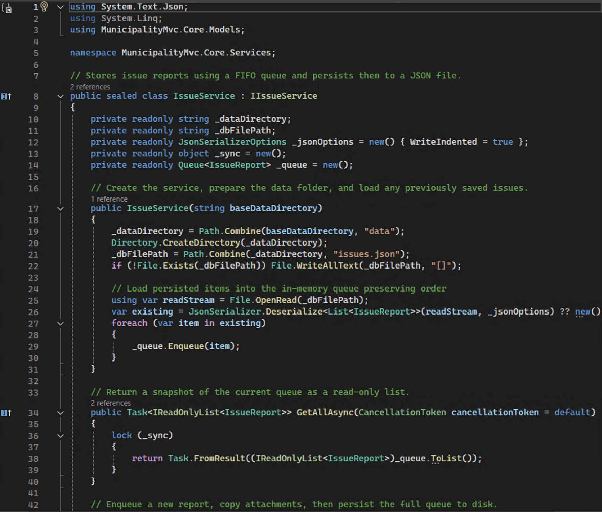

- Domain model with contact details and preferences
  - File: `MunicipalityMvc.Core/Models/IssueReport.cs`
  - Highlights: `TicketCode`, `FirstName`, `LastName`, `Email`, `Phone`, `WantsEmailUpdates`, `WantsSmsUpdates`, `AttachmentPaths`
  - Screenshot filename: `09_code_issue_report_model.png`
  - Example:
    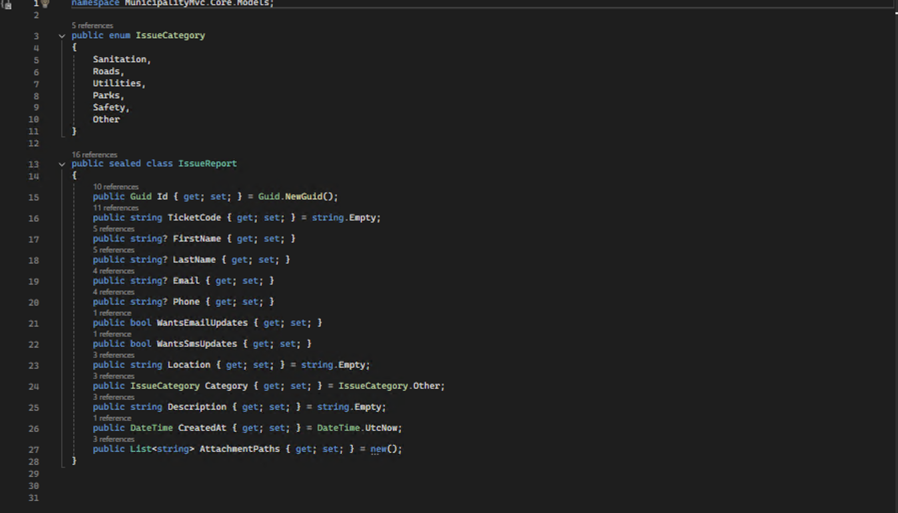

- Dependency Injection setup
  - File: `MunicipalityMvc.Web/Program.cs`
  - Highlights: registering `IIssueService` with base data folder, building and running app
  - Screenshot filename: `10_code_di_program.png`
  - Example:
    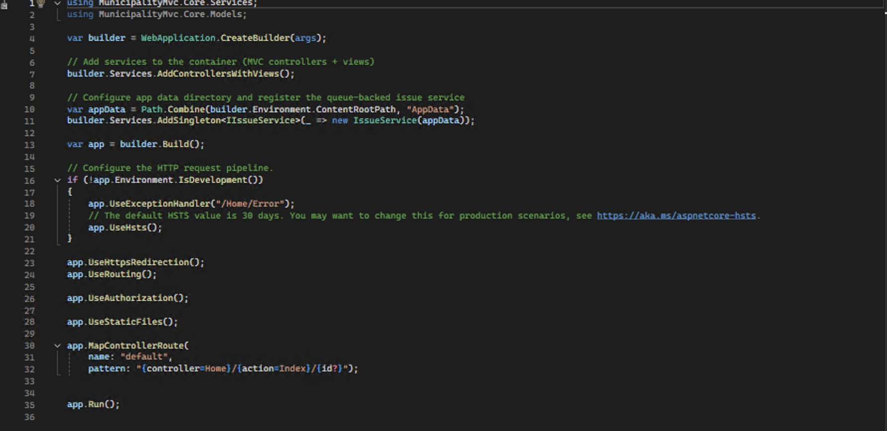

- Ticket submission and file staging
  - File: `MunicipalityMvc.Web/Controllers/ReportsController.cs` (Create POST)
  - Highlights: accepting contact + preferences, staging uploads with original filenames, constructing `IssueReport`, calling `AddAsync`
  - Screenshot filename: `code_reports_controller_create.png` (or update this link to your chosen name)
  - Example (using current image):
    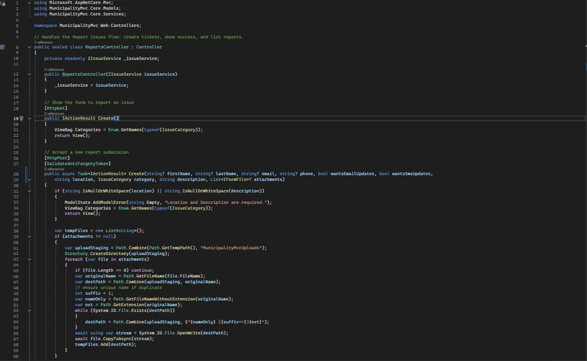

- User engagement during submission (progress + messages)
  - File: `MunicipalityMvc.Web/Views/Reports/Create.cshtml`
  - Highlights: animated progress bar, rotating toasts with staged delay
  - Screenshot filename: `code_create_progress.png`

- Success page feedback and privacy
  - File: `MunicipalityMvc.Web/Views/Reports/Success.cshtml`
  - Highlights: one-time toast/notification, queue position, ticket details
  - Screenshot filename: `code_success_toast.png`

- Public reports list with privacy adjustments
  - File: `MunicipalityMvc.Web/Views/Reports/Index.cshtml`
  - Highlights: shows Ticket, Category, Location, Description only; copy-to-clipboard; search
  - Screenshot filename: `13_code_reports_index_privacy.png`
  - Example:
    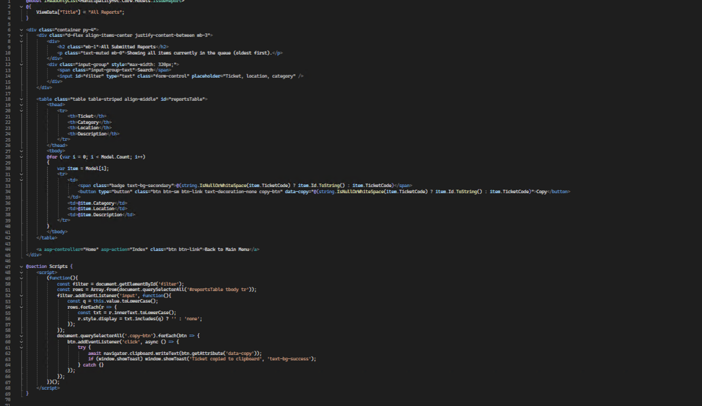

- Enqueue + persist + bottom methods
  - File: `MunicipalityMvc.Core/Services/IssueService.cs`
  - Highlights: `AddAsync` (enqueue + persist); `GetPositionAsync`; `PersistQueue()`
  - Screenshot filename: `07_code_queue_add_persist.png`
  - Example:
    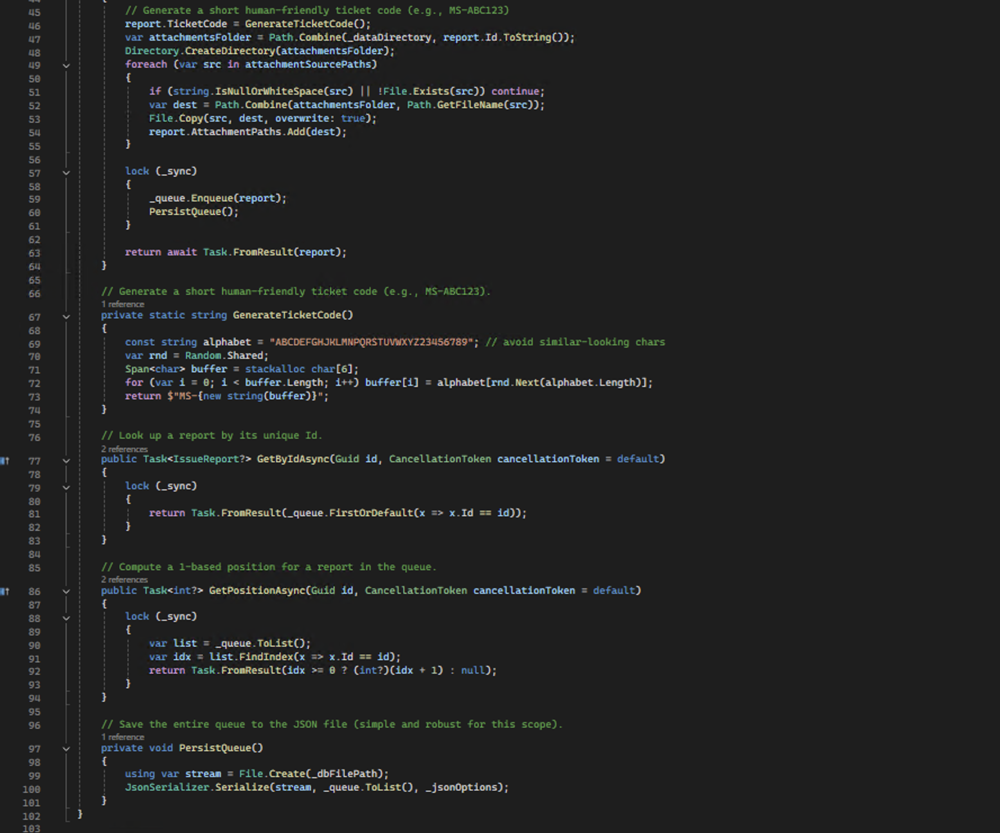

- Service contract
  - File: `MunicipalityMvc.Core/Services/IIssueService.cs`
  - Screenshot filename: `08_code_service_contract.png`
  - Example:
    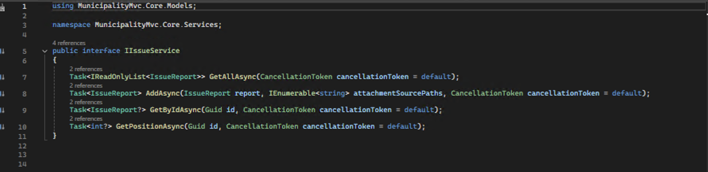

- Controller success action
  - File: `MunicipalityMvc.Web/Controllers/ReportsController.cs`
  - Screenshot filename: `12_code_reports_controller_success.png`
  - Example:
    

## Detailed code walkthrough
- Issue lifecycle (queue)
  - New tickets are enqueued and the queue is serialized to `AppData/data/issues.json` for durability
  - Queue position is computed from the current order and displayed on the success page
- Attachments
  - Uploaded files are copied to `AppData/data/<ticket-id>/` using their original filenames; the paths are saved with the ticket
- Contact & preferences
  - Optional `FirstName`, `LastName`, `Email`, `Phone`, and opt‑in switches `WantsEmailUpdates`/`WantsSmsUpdates` are stored per ticket
- UI feedback (engagement)
  - Create page: animated progress bar + rotating toasts during a brief staged delay before submission completes
  - Success page: one‑time toast and optional browser notification personalised with the submitter’s name
- Privacy in public list
  - Public list shows only Ticket, Category, Location, and Description (no personal details)

### Screenshot tips
- Use VS2022 with a dark or light theme; zoom ~120% for readability.
- Crop to the specific methods/blocks listed above, including file name in the editor tab if possible.
- Keep each image under ~1MB for repository size.

## License & Acknowledgements
- Academic use for PROG7312 Part 1 submission.
- Reference brief repository: `https://github.com/ST10359034/MunicipalServicesApp_PROG7312_POE`.

## References
- ASP.NET Core MVC docs: `https://learn.microsoft.com/aspnet/core/mvc/overview?view=aspnetcore-8.0`
- ASP.NET Core file uploads: `https://learn.microsoft.com/aspnet/core/mvc/models/file-uploads?view=aspnetcore-8.0`
- Dependency Injection in ASP.NET Core: `https://learn.microsoft.com/aspnet/core/fundamentals/dependency-injection?view=aspnetcore-8.0`
- System.Text.Json serialization: `https://learn.microsoft.com/dotnet/standard/serialization/system-text-json-overview`
- .NET Queue<T> class: `https://learn.microsoft.com/dotnet/api/system.collections.generic.queue-1`
- Bootstrap 5 documentation: `https://getbootstrap.com/docs/5.3/getting-started/introduction/`
- Bootstrap Toasts: `https://getbootstrap.com/docs/5.3/components/toasts/`
- MDN Web Docs – Notification API: `https://developer.mozilla.org/docs/Web/API/Notifications_API`
- MDN Web Docs – HTML forms basics: `https://developer.mozilla.org/docs/Learn/Forms/Your_first_form`
- W3Schools – HTML: `https://www.w3schools.com/html/`
- W3Schools – Bootstrap 5: `https://www.w3schools.com/bootstrap5/`
