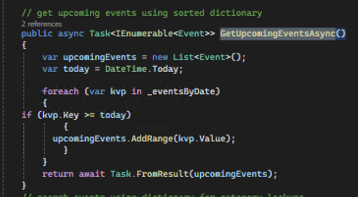

# Municipal Services Part 2 - Local Events & Announcements
**Student**: ST10359034  
**Module**: PROG7312  
**Year**: 2025

## GITHUB REPO LINK:
https://github.com/EmilFabel04/PROG7312_POE_PART2_COMPLETE

## Overview

This is my Part 2 project where I added a local events and announcements feature to the municipal services app. Users can see upcoming events, search for things, and get recommendations based on what they searched for before.

## Features

- View local events and announcements
- Search by name, category, priority, or date
- Get personalized event suggestions
- See important announcements first
- Color-coded cards to make things easier to see

## The 7 Data Structures

### 1. Stack
I used a Stack to keep track of recent searches. It works like a stack of plates - the last search you do goes on top, and that's the first one we look at for recommendations.

```csharp
private readonly Stack<UserSearchHistory> _recentSearches = new();
```


### 2. Queue  
The Queue handles announcements in order. First announcement in gets processed first (FIFO - first in first out).

```csharp
private readonly Queue<Announcement> _announcementQueue = new();
```


### 3. Priority Queue
This makes sure important announcements show up first. High priority = 1, Normal = 2, Low = 3. Lower numbers come out first.

```csharp
private readonly PriorityQueue<Announcement, int> _priorityAnnouncements = new();
```


### 4. Dictionary
Makes searching by category super fast. Instead of checking every event, I can just look up the category directly.

```csharp
private readonly Dictionary<string, List<Event>> _eventsByCategory = new();
```


### 5. Sorted Dictionary
Keeps events sorted by date automatically. No need to manually sort them every time.

```csharp
private readonly SortedDictionary<DateTime, List<Event>> _eventsByDate = new();
```



### 6. Concurrent Dictionary
Thread-safe dictionary that tracks how many times each category gets searched. Multiple users can search at the same time without issues.

```csharp
private readonly ConcurrentDictionary<string, int> _categorySearchCounts = new();
```


### 7. HashSet
Stores unique categories - automatically removes duplicates. Makes it easy to get a list of all categories without repeats.

```csharp
private readonly HashSet<string> _uniqueCategories = new();
```


## How Recommendations Work

The recommendation system is pretty simple:
1. When you search for something, it gets saved to a Stack
2. When you come back to the events page, it looks at your most recent search
3. It finds events in the same category as what you searched
4. Shows you the top 3 upcoming events from that category

If you haven't searched yet, it just shows the next 3 upcoming events.


## Project Setup

Built with:
- ASP.NET Core MVC (.NET 8)
- C#

- JSON files for storing data


## How to Run It

### In Visual Studio 2022:
1. Open the `.sln` file
2. Delete old AppData .json files if present
3. Press F5
4. Browser opens automatically

### From Command Line:
```bash
dotnet restore
dotnet build
dotnet run --project MunicipalityMvc.Web
```
Then go to: https://localhost:7034

## Screenshots

### Main Events Page
This shows the search form at the top, upcoming events in green cards, and announcements with different colors based on priority.


### Search Results
After you search, it shows the filtered results.


### Recommendations
After searching, you get personalized recommendations at the top of the events page.


## Session Management

I set up sessions in `Program.cs` so each user has their own search history that gets saved.


## Data Storage

Everything is saved as JSON files in the AppData folder:


- `events.json` - stores all events
- `announcements.json` - stores all announcements
- `search_history.json` - stores user searches for recommendations

## How I Met the Requirements

### Data Structures (40 marks):
- Stack for search history
- Queue for announcement processing  
- Priority Queue for priority announcements
- Dictionary for fast category lookups
- Sorted Dictionary for date ordering
- Concurrent Dictionary for thread-safe counting
- HashSet for unique categories

### Recommendations (30 marks):
- Tracks what users search for
- Uses Stack to get most recent search
- Shows 3 relevant events based on search history
- Saves history across sessions

## References

### Microsoft Docs
- ASP.NET Core MVC: https://learn.microsoft.com/en-us/aspnet/core/mvc/overview
- Stack<T>: https://learn.microsoft.com/en-us/dotnet/api/system.collections.generic.stack-1
- Queue<T>: https://learn.microsoft.com/en-us/dotnet/api/system.collections.generic.queue-1
- PriorityQueue: https://learn.microsoft.com/en-us/dotnet/api/system.collections.generic.priorityqueue-2
- Dictionary: https://learn.microsoft.com/en-us/dotnet/api/system.collections.generic.dictionary-2
- SortedDictionary: https://learn.microsoft.com/en-us/dotnet/api/system.collections.generic.sorteddictionary-2
- ConcurrentDictionary: https://learn.microsoft.com/en-us/dotnet/api/system.collections.concurrent.concurrentdictionary-2
- HashSet: https://learn.microsoft.com/en-us/dotnet/api/system.collections.generic.hashset-1
- Session State: https://learn.microsoft.com/en-us/aspnet/core/fundamentals/app-state
- Dependency Injection: https://learn.microsoft.com/en-us/aspnet/core/fundamentals/dependency-injection

### Tutorials & Learning Resources
- W3Schools C#: https://www.w3schools.com/cs/
- W3Schools ASP.NET: https://www.w3schools.com/asp/
- GeeksforGeeks Data Structures in C#: https://www.geeksforgeeks.org/data-structures-in-c-sharp/
- TutorialsTeacher LINQ: https://www.tutorialsteacher.com/linq

### Stack Overflow Help
- Using Stack in C#: https://stackoverflow.com/questions/3188974/what-is-the-c-sharp-stack-class
- Priority Queue implementation: https://stackoverflow.com/questions/42519/how-do-you-implement-a-priority-queue-in-c
- ASP.NET Core Sessions: https://stackoverflow.com/questions/38571032/how-to-get-httpcontext-current-in-asp-net-core
- Dictionary vs Hashtable: https://stackoverflow.com/questions/301371/why-is-dictionary-preferred-over-hashtable-in-c
- ConcurrentDictionary usage: https://stackoverflow.com/questions/12611717/concurrentdictionary-addorupdate-vs-trygetvalue-tryupdate

### Other Resources
- MDN HTML Basics: https://developer.mozilla.org/en-US/docs/Web/HTML
- MDN CSS Basics: https://developer.mozilla.org/en-us/docs/Web/CSS
- OpenAI ChatGPT: helped with debugging and understanding data structures -> https://openai.com
- Prettier: https://prettier.io/ for code formatting
